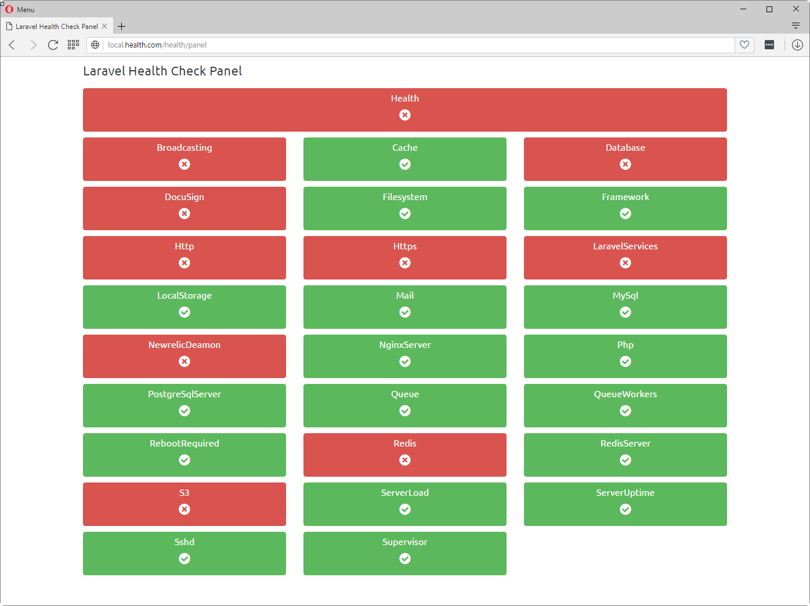
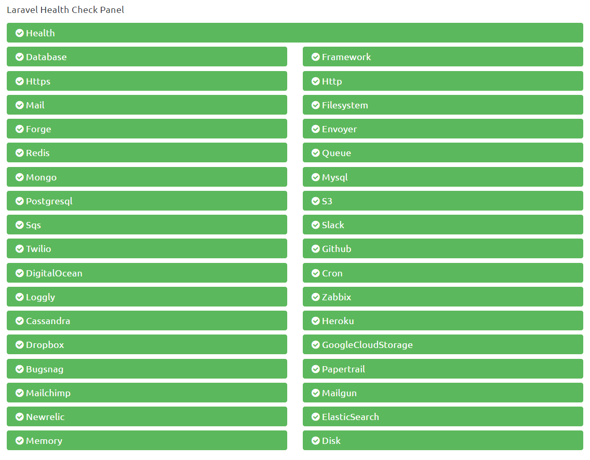
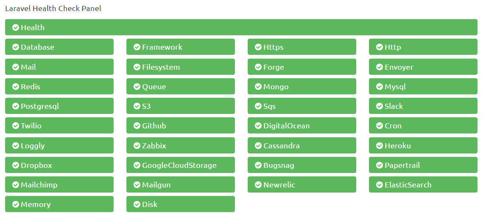
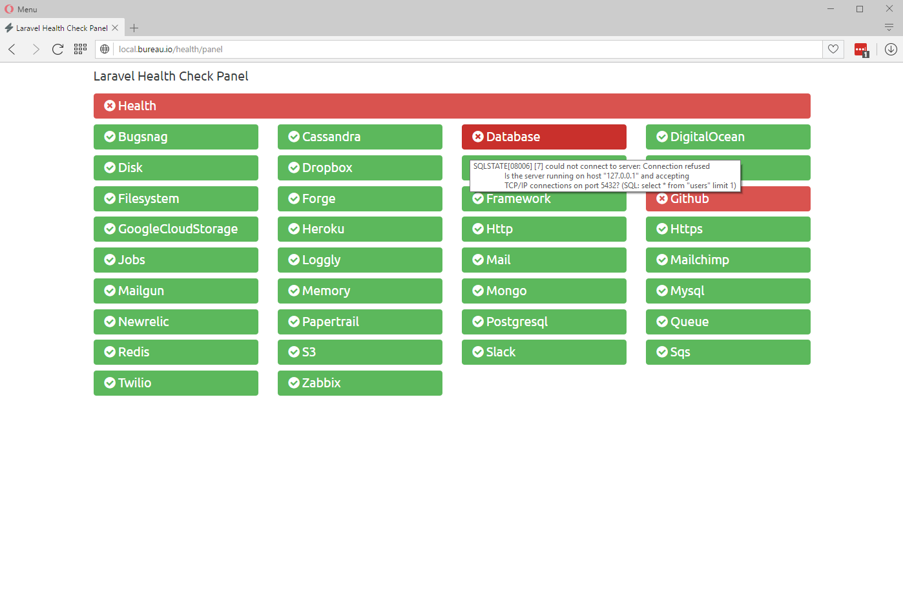
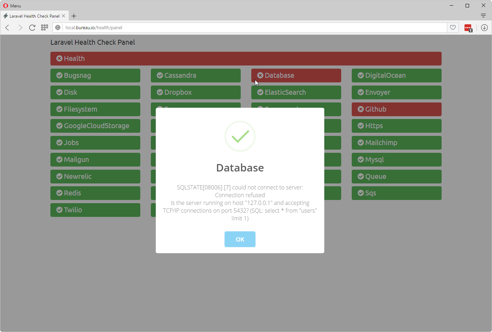
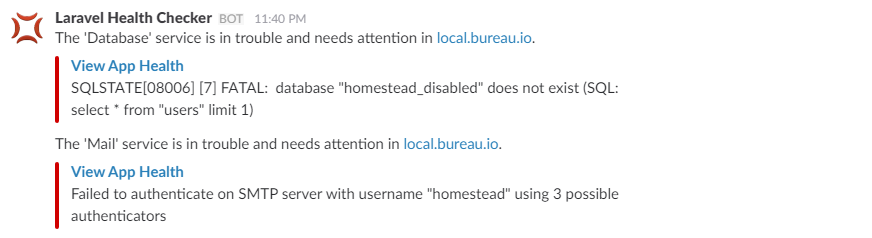
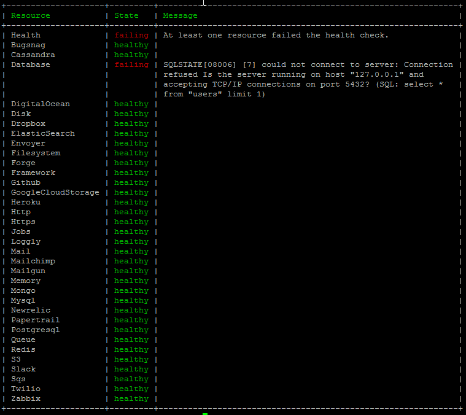
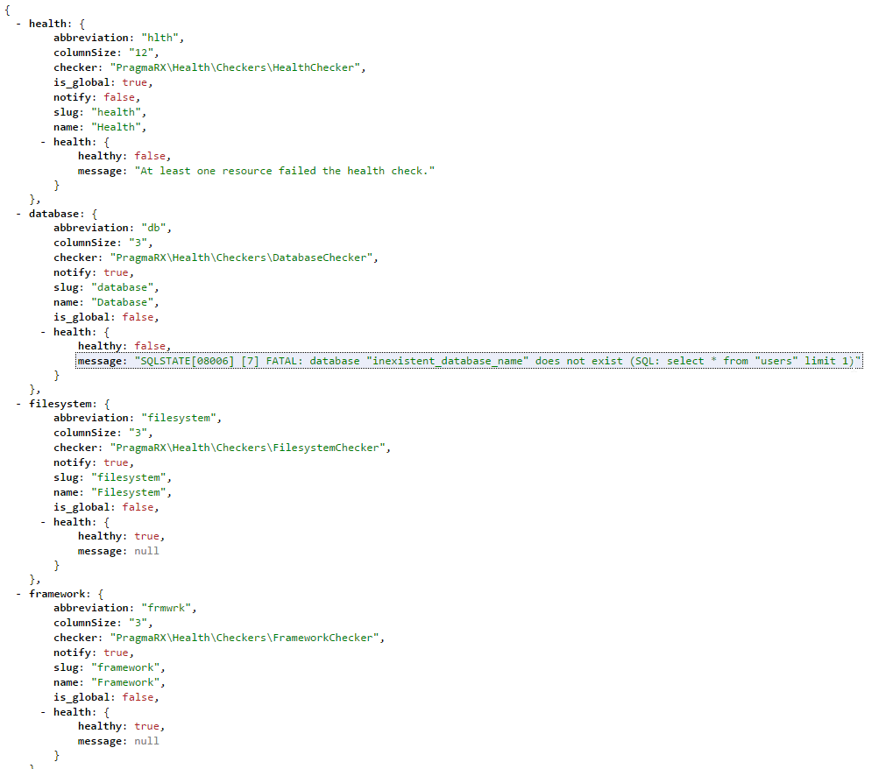
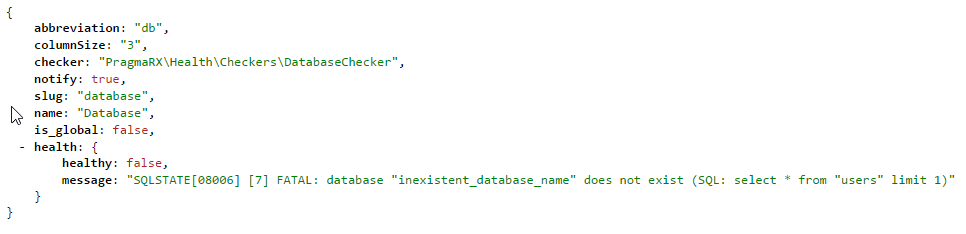

# Health
## A Laravel Health Panel And Notifier

[](https://packagist.org/packages/pragmarx/health) [](LICENSE) [](https://packagist.org/packages/pragmarx/health)

This package checks if the application resources are running as they should and creates a service status panel. It has the following main points:
 
- Highly extensible and configurable: you can create new checkers and notifiers very easily, and you can virtually change everything on it.
- Built-in notification system: get notifications via mail, slack, telegram or anything else you need.
- Resilient: if the framework is working and at least one notification channel, you should receive notification messages. 
- Routes for: panel, json result, string result and resource.
- Configurable panel design.
- Cache results and calls to services.
- View app error messages right in the panel.
- Http response codes 200 and 500, on error, for services like [Envoyer](https://envoyer.io) to keep track of your app health.

## Built-in Checkers 

Heath has pre-configured resource checkers for the following services:

- Database
- Cache
- Framework (dummy checker)
- Http & Https
- Mail
- Filesystem
- Cloud Storage

But you can add anything else you need!

## Screenshots 

### Panel



### Panel alternate design

If you have lots of services to check, you may change the default panel design to use less space:



### Panel in 4 columns layout



### Error Messages 

Mouse over a failing resource and get instant access to the error message:



Click the resource button and you'll get an alert showing the error message:



### Slack Notification

Here's an example of notification sent via Slack:



## Artisan Console Command

Use the Artisan command `health:panel` to view the status of your services in console:



## Routes

## Requirements

After installing you will have access to the folowing routes:

### /health/panel

The main panel route.

### /health/check

Returns a json with everything the package knows about your services:



### /health/string

Returns a string with status on all your services, useful when using other monitoring services:

```
hlthFAIL-dbFAIL-filesystemOK-frmwrkOK-httpOK-httpsOK-mailOK
```

### /health/resource/{name}

Returns a json with information about a particular service:



## Requirements

- PHP 5.6+
- Laravel 5.3+

## Installing

Use Composer to install it:

    composer require pragmarx/health

## Installing on Laravel

Add the Service Provider and Facade alias to your `app/config/app.php` (Laravel 4.x) or `config/app.php` (Laravel 5.x):

    PragmaRX\Health\ServiceProvider::class,

## Publish config and views

    php artisan vendor:publish

## Hit The Health Panel

    http://yourdomain.com/health/panel
    
## Configure All The Things

- Panel
- Title and messages
- Resource checkers
- Slack icon
- Sort resources in the panel
- Notification channels
- Template location
- Routes and prefixes
- Mail server
- Cache time

## Allowing Slack Notifications

To receive notifications via Slack, you'll have to setup [Incoming Webhooks](https://api.slack.com/incoming-webhooks) and add this method to your User model with your webhook: 

    /**
     * Route notifications for the Slack channel.
     *
     * @return string
     */
    public function routeNotificationForSlack()
    {
        return config('services.slack.webhook_url');
    }

## Author

[Antonio Carlos Ribeiro](http://twitter.com/iantonioribeiro)

## License

Health is licensed under the BSD 3-Clause License - see the `LICENSE` file for details

## Contributing

Pull requests and issues are more than welcome.
