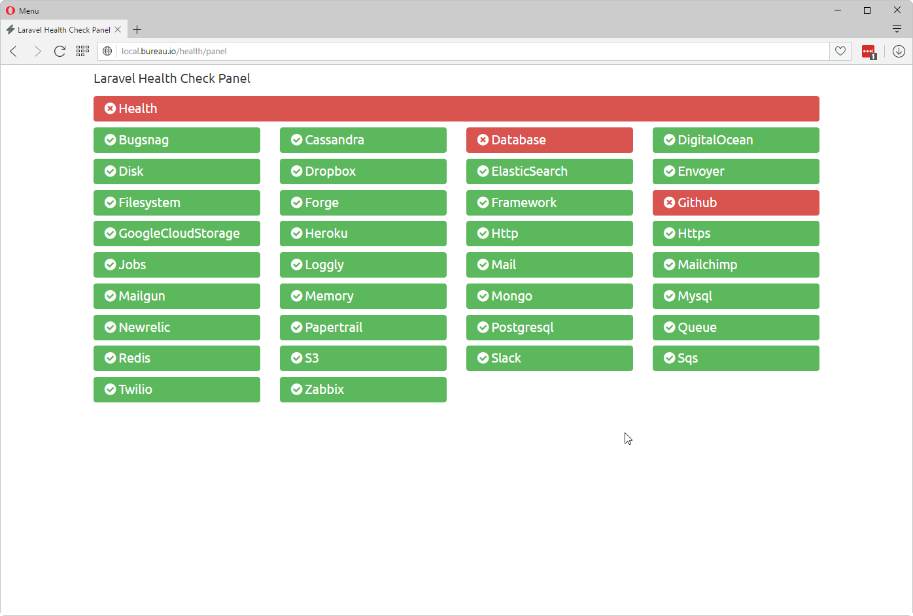

# Laravel Health Panel And Notifier

[](https://packagist.org/packages/pragmarx/health) [](LICENSE) [](https://packagist.org/packages/pragmarx/health)

This package creates a service status panel for you any Laravel app and has the follwing main points:
 
- Highly extendable and configurable: you can create new checkers and notifiers very easily, and you can virtually change everything on it.
- Resilient: if the framework is working and at least one notification channel, you should receive notification messages. 
- Built in notification system: get notifications via mail, slack, telegram or anything else you need.
- Routes for: panel, json result, string result and resource.
- Configurable panel design.
- View app error messages right in the panel.
- Http response codes 200 and 500, for error states, to ease services like [Envoyer](https://envoyer.io) to keep track of your app health.

## Screenshots 

### Panel


### Panel alternate design

If you have lots of services to check, you may change the default panel design to use less space:


### Panel in 4 columns layout



### Error hint 


### Slack Notification


## Routes

## Requirements

After installing you will have access to the folowing routes:

### /health/panel

The main panel route.

### /health/check

Returns a json with everything the package knows about your services:


### /health/string

Returns a string with status on all your services, useful when using other monitoring services:

```
hlthFAIL-dbFAIL-filesystemOK-frmwrkOK-httpOK-httpsOK-mailOK
```

### /health/resource/{name}

Returns a json with information about a particular service:


## Requirements

- PHP 5.6+
- Laravel 5.2+

## Installing

Use Composer to install it:

    composer require pragmarx/health

## Installing on Laravel

Add the Service Provider and Facade alias to your `app/config/app.php` (Laravel 4.x) or `config/app.php` (Laravel 5.x):

    PragmaRX\Health\ServiceProvider::class,

## Publish config and views

    php artisan vendor:publish

## Config file gives you access to change virtually everything in this package:

- Title and messages
- Create, enable and disable resource checkers
- Create, enable and disable notification channels
- Template location
- Http routes and prefixes
- Mail server configuration

## Author

[Antonio Carlos Ribeiro](http://twitter.com/iantonioribeiro)

## License

Health is licensed under the BSD 3-Clause License - see the `LICENSE` file for details

## Contributing

Pull requests and issues are more than welcome.
